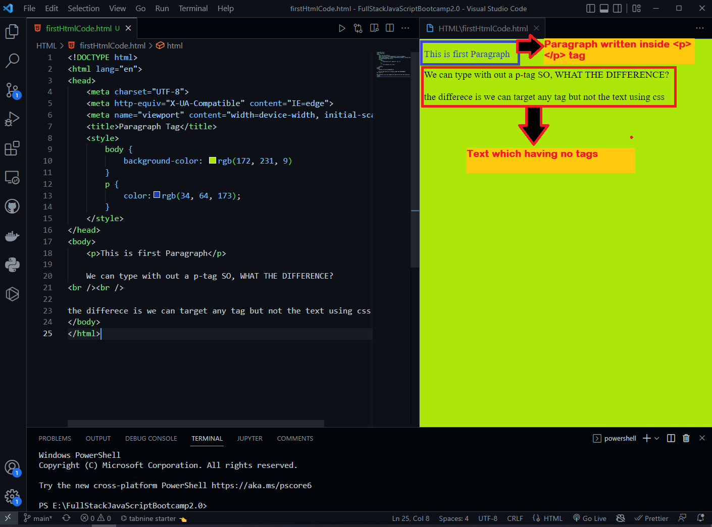

# FullStackJavaScriptBootcamp2.0 Practices

### Paragraph vs Normal Text Without elements:

### Points:
1. Targeting of element become easy for manipulating the text content by using tags or elements.

2. Every tag/ement has a unique qualities that no other tags or elements have.

3. Appropriate tags/elements help to improve page ranking or SEO purpose.

